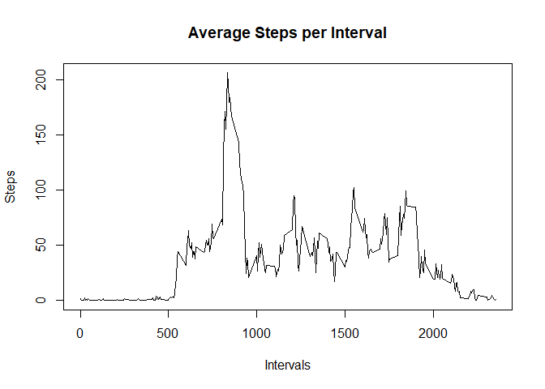
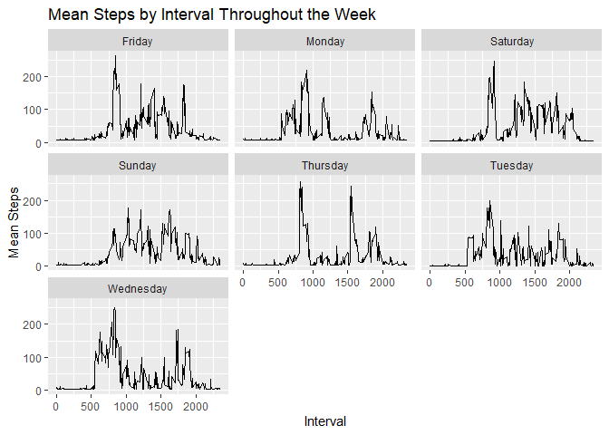

## Loading and preprocessing the data

The following code serves to load the activity data and necessary packages. 


```r
activity <- read.csv("activity.csv", header = T)
activity[,2] <- as.Date(activity$date)

library(ggplot2)
library(dplyr)
```

```
## 
## Attaching package: 'dplyr'
```

```
## The following objects are masked from 'package:stats':
## 
##     filter, lag
```

```
## The following objects are masked from 'package:base':
## 
##     intersect, setdiff, setequal, union
```


## Q1: What is mean total number of steps taken per day?

We'll start by grouping our data by date, and then finding the total number of steps for each group and plotting the results in a histogram:


```r
activity %>% group_by(date) %>% summarise(perDay = sum(steps, na.rm = T)) %>%
  ggplot(aes(perDay)) + geom_histogram(bins = 5) + 
  ggtitle("Total steps per day") +
  xlab("Steps Per Day") + ylab("Frequency")
```

<!-- -->

By inspection, the plot seems to follow an approximately Gaussian distribution centered at 10'000. Let's calculate the mean and median to confirm:


```r
stepsPerDay <- with(activity, tapply(steps, date, sum, na.rm = T))

print(mean(stepsPerDay))
```

```
## [1] 9354.23
```

```r
print(median(stepsPerDay))
```

```
## [1] 10395
```
As expected, the mean and median are close to 10'000.


## What is the average daily activity pattern?

To find the average daily activity pattern we can average the number of steps taken per 5 minute interval across all of the dates and then display this data in a time series plot:


```r
meanSteps <- with(activity, tapply(steps, interval, mean, na.rm = T))
Ints <- unique(activity$interval)
plot(x = Ints, y = meanSteps, type = "l",
     xlab = "Intervals", ylab = "Steps",
     main = "Average Steps per Interval")
```

<!-- -->

By inspection the maximum average number of steps seems to occur between the 750 and 1000 intervals. We can confirm this with the follow operations:


```r
index <- which.max(meanSteps)
print(meanSteps[index])
```

```
##      835 
## 206.1698
```

This confirms what can see in the plot, telling us that a maximum average steps of 206.1698 occurs in the interval 835.

## Imputing missing values

Several step observations are missing in our data set.

```r
sum(is.na(activity$steps))
```

```
## [1] 2304
```

We can correct this by substituting all of the na values with the average number of steps per day:

```r
index <- which(is.na(activity$steps))
l <- length(index)
avgPerDay <- with(activity, tapply(steps, date, mean, na.rm=T))
avg <- mean(avgPerDay, na.rm=T)

for (i in 1:l){
  activity[index[i],1] <- avg
}
```

Checking to see if we've removed all the na values:

```r
sum(is.na(activity$steps))
```

```
## [1] 0
```

Now we can plot the data again to see how results have changed:

```r
activity %>% group_by(date) %>% summarise(perDay = sum(steps, na.rm = T)) %>%
  ggplot(aes(perDay)) + geom_histogram(bins = 5) + 
  ggtitle("Total steps per day") +
  xlab("Steps Per Day") + ylab("Frequency")
```

<!-- -->

The data appear even more Gaussian than before. We can also see that the mean and median have changed slightly:

```r
stepsPerDay2 <- with(activity, tapply(steps, date, sum, na.rm = T))
print(mean(stepsPerDay2))
```

```
## [1] 10766.19
```

```r
print(median(stepsPerDay2))
```

```
## [1] 10766.19
```

## Are there differences in activity patterns between weekdays and weekends?

To determine if there is a difference in activity on the weekends we first need to create a new variable that tells us whether each observation falls on a weekday, or weekend. We'll call this variable "day".


```r
activity2 <- activity %>% mutate(day = ifelse(weekdays(date) == "Saturday" | weekdays(date) == "Sunday", "weekend", "weekday"))

activity2$day <- as.factor(activity2$day)
```


Now we can plot the observations for weekday and weekend separately:


```r
activity2 %>% group_by(day, interval) %>% mutate(meanStepsInterval = mean(steps)) %>% ggplot(aes(x = interval, y = meanStepsInterval)) + geom_line() +
  facet_wrap(~day) + ggtitle("Mean Steps by Interval: Weekend vs. Weekday") +
  xlab("Interval") +ylab("Mean Steps")
```

<!-- -->

From this plot we can see that although the average steps peak higher on weekdays in the early hours (most likely from people commuting to work/school) activity levels are more consistent and slightly higher on the weekends.

We can go one step further and group the data by each separate day:


```r
activity2 %>%
  mutate(weekday = weekdays(date)) %>% group_by(weekday, interval) %>% mutate(meanStepsInterval = mean(steps)) %>% ggplot(aes(x = interval, y = meanStepsInterval)) +facet_wrap(~weekday) + geom_line() + ggtitle("Mean Steps by Interval Throughout the Week") + xlab("Interval") + ylab("Mean Steps")
```

<!-- -->

Again we see a similar trend of higher peaks on weekdays and more consistent activity on the weekends. Interestingly, Friday seems to be closer to Saturday/Sunday than to other weekdays in terms of consistently high levels of activity.
